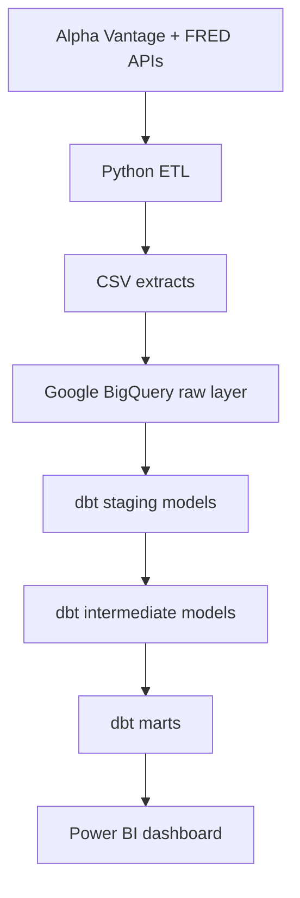

# Zenith Financial Analytics Platform

Zenith is a portfolio-grade financial analytics pipeline that ingests market and macroeconomic data, standardizes it in BigQuery with dbt, and prepares executive-ready outputs for Power BI.

## What It Does

- Collects daily equity pricing data from Alpha Vantage.
- Collects macroeconomic indicators from FRED.
- Loads curated CSV extracts into BigQuery.
- Transforms raw data into staging, intermediate, and mart layers with dbt.
- Produces analytics-ready datasets for portfolio monitoring and executive reporting.

## Architecture



## Project Structure

```text
.
|-- ingest.py
|-- upload_to_bigquery.py
|-- raw_equity_prices.csv
|-- raw_macro_indicators.csv
|-- zenith_dbt/
|   |-- dbt_project.yml
|   `-- models/
|       |-- staging/
|       |-- intermediate/
|       `-- marts/
|-- .env.example
|-- SECURITY.md
`-- CONTRIBUTING.md
```

## Quick Start

### 1. Install dependencies

```bash
pip install -r requirements.txt
```

### 2. Configure secrets locally

Use [.env.example](/C:/Users/hp/zenith-capital-pipeline/.env.example) as a template and set the values in your shell or IDE environment:

```bash
ALPHA_VANTAGE_API_KEY=...
FRED_API_KEY=...
GOOGLE_APPLICATION_CREDENTIALS=...
GOOGLE_CLOUD_PROJECT=zenith-capital-498002
BIGQUERY_DATASET=zenith_raw
```

### 3. Ingest source data

```bash
python ingest.py
```

### 4. Load raw data to BigQuery

```bash
python upload_to_bigquery.py
```

### 5. Build analytics models

```bash
cd zenith_dbt
dbt run
dbt test
```

## Core Outputs

- `int_equity_returns`: daily returns plus rolling market metrics by ticker.
- `int_macro_signals`: macro trend direction and economic health signals.
- `mart_portfolio_performance`: portfolio-level return summary by ticker.
- `mart_risk_metrics`: volatility, max gain, and max loss by ticker.
- `mart_executive_summary`: executive-facing combined market and macro snapshot.

## Notes

- Sample CSV extracts are included so the repository is easy to understand locally.
- The repository currently does not include a checked-in Power BI artifact, so the semantic outputs for reporting are represented by the dbt marts.
- Secrets and service-account files must stay local and out of Git.
